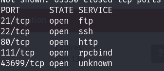

# Protocolo actuación ante un ataque cibernético

La pildora de esta semana es va a tratar sobre el protocolo de actuacion en caso de una cibercrisis.

### ¿Que es una cibercrisis?

Por crisis se entiende cualquier circunstancia, deliberada o fortuita, ocasionada internamente o no, que produce un desequilibrio en una organización con su servicio, clientes, accionistas, trabajadores y representantes sindicales, autoridades u otras empresas o entidades, afectando o dañando la imagen y reputación pública, con la consecuente pérdida económica o incumplimiento legal, pudiendo poner en peligro su viabilidad económica y/o futuro profesional.

Ante una crisis, tres son los elementos a tener en cuenta: la **amenaza** a la organización, el **elemento sorpresa** (imprevisible e inesperado) y el **corto período** de tiempo que se exige para la toma de decisiones.

<figure><figcaption></figcaption></figure>


Las capacidades y estructuras de gestión necesarias para hacer frente a una crisis no se improvisan cuando esta surge, es imprescindible desarrollarlas **con antelación.**


### Protocolo de actuación


Fuente: [CCN-Cert Informe de Buenas Prácticas en la Gestión de cibercrisis](https://www.ccn-cert.cni.es/seguridad-al-dia/novedades-ccn-cert/12408-nuevo-informe-de-buenas-practicas-bp-29-gestion-de-crisis-para-ciberincidentes-en-entidades-locales.html).


**Ambitos fundamentales para abordar una crisis:**&#x20;

Liderazgo > Preparación > Respuesta > Comunicación > Cierre

<figure><figcaption>
Resumen de buenas practicas CCN-CERT
</figcaption></figure>

1.  **Liderazgo:**&#x20;

    En el caso de los ciberincidentes es fundamental la función de Responsable de Seguridad de la Información, que será el primero en categorizar el evento y la idoneidad o no de convocar el Comité de Crisis.
2.  **Preparacion:**

    1. **Planes y protocolos estructurales:** para una gestión efectiva de la crisis viene determinada por la capacidad de anticipación e identificación de los ámbitos más vulnerables (gestión de riesgos) que pueden llegar a transformarse en situaciones críticas.
    2. **Comité de Crisis. Configuración:** Estará liderado por el Responsable del Comité de Crisis, figura con máxima capacidad de decisión (CEO de la compañía o máximo responsable del organismo, en caso del sector público). Junto a ellos deberían tener representación cada una de las áreas básicas en una organización: Responsables de Seguridad de la Información (RSI), Infraestructura, Procesos, Recursos Humanos, Legal y Comunicación. Porque la gestión de una crisis, aunque su origen sea un ciberincidente, no es algo exclusivo del equipo de seguridad, sino que implica a toda la organización.

    <figure><figcaption></figcaption></figure>

    <figure><figcaption></figcaption></figure>
3.  **Control permanente de la superficie de exposición**

    Un elemento clave es la evaluación de la superficie de exposición de las entidades, identificando las vulnerabilidades asociadas a sus servicios y aplicaciones.

    **Gestión adecuada de grupos de interés. Stakeholders**

    Los grupos de interés o stakeholders son personas o colectivos del entorno de la organización que se pueden ver afectados por cualquier actividad que esta realice.

    Por esta razón se aconseja desarrollar el denominado “Mapa de stakeholders” donde los distintos niveles jerárquicos de la organización deben identificar aquellos a los que puede afectar la crisis:

    <figure><figcaption></figcaption></figure>

    <figure><figcaption></figcaption></figure>
4. **Respuesta**
   1.  **Diagnóstico inicial y escenarios posibles**

       Este primer diagnóstico se debe incluir la notificación inicial al CERT de referencia para recibir soporte alineado con el problema, indicaciones de actuación específicas y herramientas de diagnóstico y operación complementarias y actualizadas. Todo ello permite una reacción rápida que, en muchos casos, o bien atajará el ataque en su totalidad o limitará de un modo importante sus impactos sobre la organización y sobre el tejido empresarial afectado.

       1.  **Coordinación:**

           La improvisación y la falta de coordinación son ingredientes de una receta para el fracaso.

           Por esta razón, el disponer de un Comité de Crisis, tal y como se ha reseñado anteriormente, con experiencia y capacidad de gestión es uno de los primeros y más importantes pasos a seguir durante una crisis, pues estas personas serán las que asuman y asignen responsabilidades, competencias y recursos para solucionar el problema.
       2.  **Iniciativa y proactividad**

           Ante un primer aviso de crisis, la organización reaccione con rapidez y contundencia haciendo una notificación inicial sin dilación indebida y tome la iniciativa. Se trata, por lo tanto, de que la organización sea proactiva y no reactiva, que tome sus decisiones con rapidez y que se posicione para liderar la gestión de la crisis
5. **Comunicación: Discurso informativo**
   1.  **Discurso unificado y fuente oficial de información**

       Una vez que se haya considerado que un incidente ha pasado a la categoría de crisis es fundamental proceder a la elaboración de la información más adecuada teniendo en cuenta: **tiempo o prioridad y grupo de interés** (stakeholder).

       En función de estos dos parámetros, y asesorados por el área de Comunicación, se definirán el tipo de información a ofrecer, los mensajes clave, el formato y el canal o medio (reuniones informales, videoconferencias, correos electrónicos, listas de distribución, llamadas, intervenciones presenciales, discursos, juntas de accionistas, Dark Site14, mensajería como WhatsApp o Telegram, etc.)

       El responsable de comunicar sera la **propia organización.**

       Dichos mensajes deben tener las siguientes características:

       1. Nunca se debe negar la realidad.&#x20;
       2. No mentir nunca y ser transparentes Dar siempre la versión de la organización, situándose como la fuente de información más creíble y precisa&#x20;
       3. Transmitir confianza. Actuar con serenidad, firmeza y profesionalidad&#x20;
       4. Demostrar una cuidadosa atención, respeto y un compromiso total hacia todos los involucrados&#x20;
       5. Pedir disculpas y asumir las responsabilidades si fuese necesario (no culpar a otros)
       6. Poner en valor todas las acciones realizadas Asegurar que la actividad/negocio es viable
   2.  **Transparencia, empatía y asunción de responsabilidades**

       Se evitará mencionar las causas del incidente, su responsable, datos que la investigación pueda revelar o las posibles consecuencias para la organización o para otro grupo de interés.
   3. **Puesta en valor de las acciones adoptadas (No necesario)**
6. **Cierre: lecciones aprendidas (No necesario)**
   1.  **Cierre formal de la crisis (No necesario)**

       La principal práctica para un cierre correcto es dedicar tiempo y recursos a evaluar los daños y, sobre todo, a recopilar unas lecciones aprendidas e implementarlas en la realidad de la organización, así como en comunicar dicho cierre, tanto a nivel interno como externo.

       Los análisis pertinentes, el levantamiento de conclusiones, la definición de un plan de acción y el seguimiento de su implantación son pasos indispensables en el cierre de la cibercrisis y en muchas ocasiones se realizan sólo a medias.
   2.  **Implementación de lecciones aprendidas (No necesario)**

       Se quiere enfatizar la necesidad de hacer un esfuerzo de resumen de lo sucedido sintetizándolo en acciones concretas a implementar.
